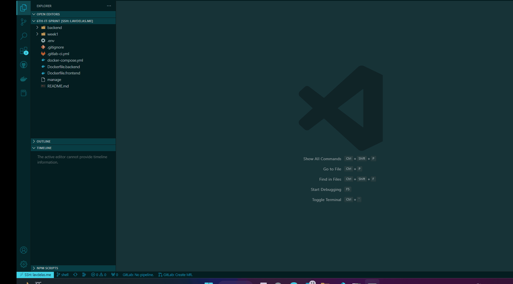
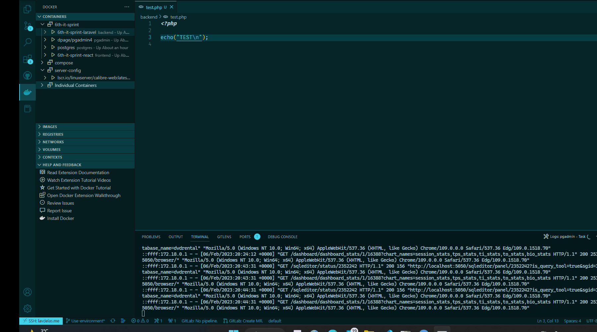

# 6th IT Sprint

Welcome to the main repo of the 6th IT Sprint, hosted by LC Skopje! The IT Team is exited to have you here and take you on a journey through the layers of a stack for modern web apps.

## Installation

At the 6th IT Sprint we will develop from within docker containers. This is to achieve more or less uniform development environments and save us from the messiness of many different dependency versions and operating systems.

### Docker

What even is docker? We cover this in [week one of the event preparations!](week1/knowledge.md)

Docker comes as a pure command line utility and as a desktop application (that also includes the cli programs). For Windows and Mac
we recommend installing the desktop application, on linux the command line utility is sufficient.

#### Windows

**Warning**: Docker installation instructions state that at least 4GBs of RAM are required, but from
my experience even 8GB might not be enough to run everything together with your usual Windows tasks
(since WSL is a whole VM inside Windows).
If you have a low-end laptop and/or don't have access to any stronger or linux machine, please contact us.

- [Enable WSL and install Ubuntu](https://learn.microsoft.com/en-us/windows/wsl/install)
- [Install Docker Desktop](https://docs.docker.com/desktop/install/windows-install/)

#### MacOS

- [Install Docker Desktop](https://docs.docker.com/desktop/install/mac-install/)

#### Linux

- Install Docker (no need to install Docker Desktop)
  - You can ind the instructions for your distribution [here](https://docs.docker.com/engine/install/). We recommend
    using the Docker repository, rather than the one from your distribution, since they have quite older versions.
- Install VSCode

### VSCode

**Warning**: We only support VSCode for development, if you face any issues on the editor of your choice
(which for the most part you shouldn't face anyway), we might not be able to help.

- [Install VSCode](https://code.visualstudio.com/)
- Setup VSCode
  - Install the following extensions:
    - Required:
      - [docker](https://marketplace.visualstudio.com/items?itemName=ms-azuretools.vscode-docker)
      - **Necessary Windows only (but useful in general)**: [Remote development](https://marketplace.visualstudio.com/items?itemName=ms-vscode-remote.vscode-remote-extensionpack) (extension pack) - Used in Windows for connecting VSCode to WSL, but
      can also be used for remote connecting to containers.
    - Suggested:
      - [VSCode extensions useful for front-end work.](https://gitlab.com/eestec/eestec-net/eestec.net-frontend/-/wikis/Editors)

## Deployment (Linux & Mac)

Make sure you have this repository [cloned to your local machine](pre-event-preparations/week1/knowledge.md)!


The script `manage` is a wrapper around docker compose. We use it to make sure that the containers the containers use the same group_id:user_id as the local system.

```bash
./manage build
./manage up -dg
```

You successfully ran those commands if your output to `docker ps` looks something like this:

```bash
> docker ps
CONTAINER ID   IMAGE                   COMMAND                  CREATED          STATUS         PORTS                                                 NAMES
c49eba663bef   6th-it-sprint-laravel   "docker-php-entrypoi…"   35 seconds ago   Up 3 seconds   0.0.0.0:8000->8000/tcp, :::8000->8000/tcp, 9000/tcp   backend
0519ef8ca2c7   dpage/pgadmin4          "/entrypoint.sh"         35 seconds ago   Up 3 seconds   443/tcp, 0.0.0.0:5050->80/tcp, :::5050->80/tcp        pgadmin
cd2673db1757   postgres                "docker-entrypoint.s…"   36 seconds ago   Up 4 seconds   0.0.0.0:5432->5432/tcp, :::5432->5432/tcp             postgres
448f99a76904   6th-it-sprint-react     "docker-entrypoint.s…"   36 seconds ago   Up 4 seconds   0.0.0.0:3000->3000/tcp, :::3000->3000/tcp             frontend
```

## Deployment on Windows

We will primarily be using WSL for working on the infrastructure. As we mentioned WSL is a separate virtual machine, so you can treat it as
a separate computer sort of.

1. Check that git is installed. Test if git is installed with `git -v`.
2. Copy the ssh key you created for gitlab to wsl. If your username is leonidas, it would look like

     ```bash
     wsl # Connect to the virtual machine
     cd ~ # Go to the home folder
     cp /mnt/c/Users/Leonidas/.ssh/id_ed25519_sk ~/.ssh/ # Copy the key
     chmod 600 ~/.ssh/id_ed25519_sk # Change permissions to the key
     ```

3. Clone the repository as described in [week 1](pre-event-preparations/week1/knowledge.md)!
4. Make sure that frontend and backend folders have the correct permissions and are owned by your user.

    ```bash
    whoami # Figure out your username, for me lavdelas
    sudo chown -R lavdelas:lavdelas frontend/ backend/
    ```

5. Follow the instructions described for Linux to run the manage command (see above).

## Use the Environment

If you achieved to get the output above, you have everything running on your computer that you will need to develop leveraging the tech stack we intend to teach at the 6th IT Sprint. Each line of that output represents one _container_.

You can think of a container as a simulation of another computer, running on your computer. We will use the two containers named backend and frontend to code inside. The folders 'backend' and 'frontend' of this repo will be available to the respective containers.

To connect to ('get inside of') a container, open the docker extension in VSCode, right-click the desired container and select connect console:



You now have access to the shell of the simulated computer (the container). The backend/frontend containers each have all the necessary tools installed that you will need to learn the respective technologies.

## Start a React Project

To create a react project run:

```bash
yarn create react-app .
```

Then to run the project, run `yarn start`. This should be enough to get you started.

## Start a Laravel Project

Inside the backend container run:

```bash
composer create-project laravel/laravel .
```

Then copy DB configuration from top level `.env` file to `backend/.env` file.

Once the Laravel project has been set up and the .env file was adjusted, move to the project folder and run the application using the following command:

```bash
php artisan serve --host 0.0.0.0
```

The expected output is the following:

```bash
INFO  Server running on [http://127.0.0.1:8000].
```

where you ctrl+click the link in order to open it in the browser, or you copy-paste the link in your browser directly.

## Running your PHP files

In order to run your PHP files, please attach a shell (as explained before) to your backend, open the terminal and run the `php file_name.php` command.


