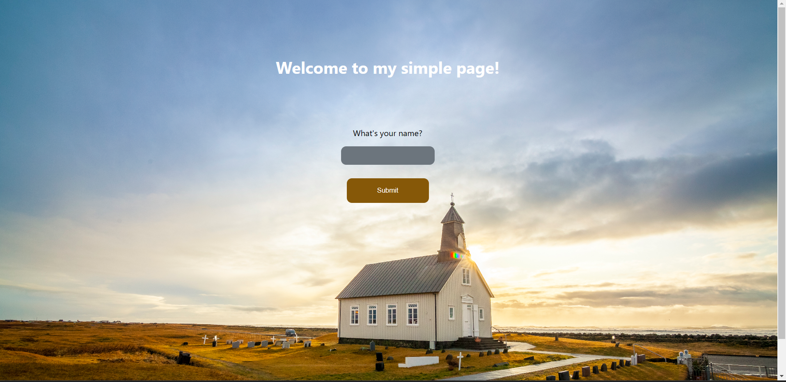
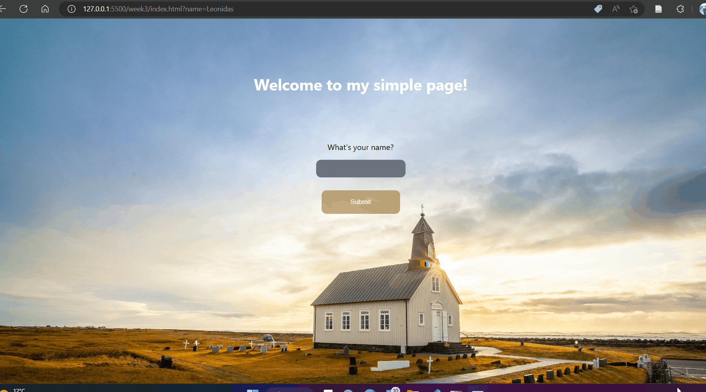

# Week 3

Welcome to week 3, the final week before IT Sprint! During this
week we will polish up our frontend skills to create a nice looking website that all our friends will be envy of.

We will be covering 4 topics:

- HTML
- CSS
- DOM
- Javascript

## HTML & CSS

When it comes to playing with HTML & CSS easily, you have two options:

 1. The old-fashioned approach where you just open your HTML file on your browser. This always works, but you need to keep in mind to refresh after every change.
 2. If you feel you want to go more pro mode, and improve your workflow, [this VSCode extension](https://marketplace.visualstudio.com/items?itemName=ritwickdey.LiveServer) basically reloads the HTML file every time you hit save, which is a QoL improvement.

If you are new to HTML, you can go through the tutorial [here](https://www.youtube.com/watch?v=916GWv2Qs08) up to ~40 mins mark or if you are a reader this [Mozilla docs HTML introduction](https://developer.mozilla.org/en-US/docs/Learn/HTML). This should teach you everything you need to know about HTML and more.

When it comes to CSS, the [Mozilla docs](https://developer.mozilla.org/en-US/docs/Learn/CSS) are still a great source of information, or if you prefer a video [here](https://www.youtube.com/watch?v=1PnVor36_40) is one.

### Task 1

- Create a very simple website with a background image and a form requesting for the name of the user. *The button should be disabled by default.*

You can take inspiration from our take:

**Note:** You do not have to use the same background image or colors, and it is suggested that you find a background that both suits your tastes, and does not get the content invisible from [here](https://unsplash.com/).

## Javascript

Javascript was for a very long time, the only language used inside
browsers and still mostly is. While it sounds like Java, it has little resemblance, except the name and the C-like syntax.

[This video](https://www.youtube.com/watch?v=9emXNzqCKyg) introduces us succinctly to Javascript.

Fetch is a built-in library for doing API request in Javascript. [This link](https://developer.mozilla.org/en-US/docs/Web/API/Fetch_API/Using_Fetch) provides useful information, or [this video](https://www.youtube.com/watch?v=cuEtnrL9-H0) if you are more comfortable watching a video.

Async Functions are also another way of dealing with fetch api, you can take a look on how it works [here](https://developer.mozilla.org/en-US/docs/Web/JavaScript/Reference/Statements/async_function)

### Task 2

As you might have noticed, there is a `Excercise.js` file included in the folder, please open that file and complete the functions as wanted.

## DOM

A very important aspect of understanding how a browser takes HTML and CSS and orders the elements and what a user can see is the Document Object Model. It's super important to understand the basics of it, so we can then add nodes and elements dynamically.

We recommend [Mozilla Docs](https://developer.mozilla.org/en-US/docs/Learn/JavaScript/Client-side_web_APIs/Manipulating_documents) for learning what DOM is and how to manipulate it.

In order to complete the tasks, you will need to know a bit about events that happen in the browser, [this Mozilla Docs](https://developer.mozilla.org/en-US/docs/Learn/JavaScript/Building_blocks/Events) link is just for that!

### Task 3

We will continue Task 1 and add DOM manipulation so that interesting things happen when we click the button.

- When the input element content is empty,the button should be disabled, but when characters are added in the input form, the button should activate.
- When the button is clicked, the input element contents should be added into the DOM as a paragraph element just below the button.
- When the button is clicked with a different name, the previous paragraph should be removed (or changed) and the new one should be visible.

You can see this interaction better below:

